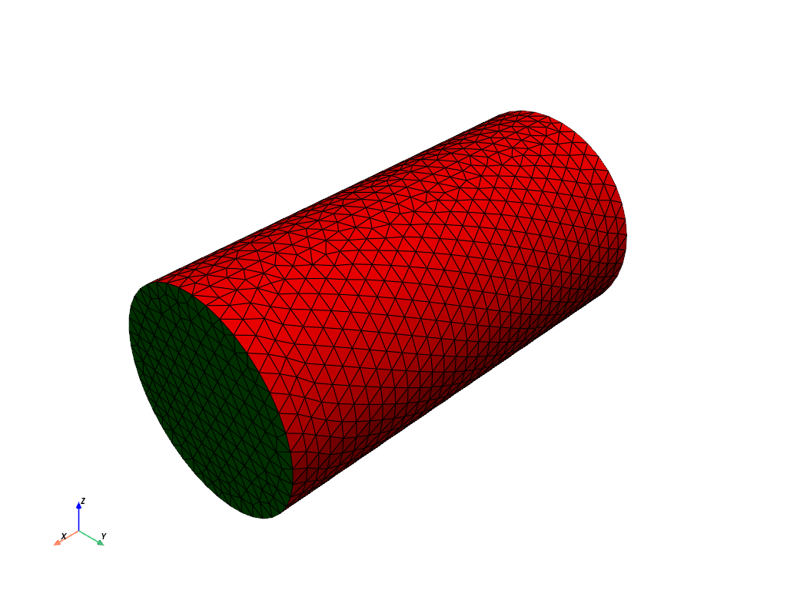

# FEniCSx - Meshing and Torsion tutorials

In this tutorials, we will learn how to mesh a cylinder, and run a FEA code to obtain the behavior of the cylinder (Arruda-Boyce model) undergoing torsion. If you already have FEniCSx installed, please check the Installation Instructions for other packages relevant to meshing.

## Table of Contents

* [Installation Instructions](#install)
* [Meshing a Cylinder](#mesh)
* [Twisting a Cylinder](#twist)

## Installation Instructions <a name="install"></a>

To use the codes in this tutorials, please begin by setting up FEniCSx:
```bash
mamba create --name fenicsx-env
mamba activate fenicsx-env
mamba install -c conda-forge fenics-dolfinx openmpi pyvista
```

Then, we need to install additional packages for meshing:
```bash
pip install pygmsh
mamba install h5py
```

When running the code for the first time, VSCode will prompt you to install ipykernel, necessary to run Jupyter Notebook.

## Meshing a Cylinder <a name="mesh"></a>
This tutorial (``tutorials/mesh_cylinder.ipynb``) guides you through meshing a cylinder using [Gmsh](https://gmsh.info/), an open-source 3D finite element mesh generator with a built-in CAD engine and post-processor. Although the example focuses on a simple cylinder, the same principles can be applied to more complex geometries by referring to the [Gmsh documentation](https://gmsh.info/doc/texinfo/gmsh.html#Gmsh-application-programming-interface) — particularly Chapter 6, which covers the programming interface. Here, we show the cylinder mesh generated from our codes:



For a deeper dive into Gmsh meshing tailored for FEniCSx, check out this detailed [tutorial](https://jsdokken.com/src/tutorial_gmsh.html) by Dokken.

## Twisting a Cylinder <a name="twist"></a>
Now that we have a cylinder mesh, we can twist the mesh by fixing the bottom, and applying the following Dirichlet boundary conditions at the top:

$u_x=0,$

$
u_y = \left(
    y_0 + 
    (x_1 - y_0) \cos\left(\theta_{\text{tot}} \left(\frac{t}{T}\right)\right) - 
    (x_2 - z_0) \sin\left(\theta_{\text{tot}} \left(\frac{t}{T}\right)\right) - 
    x_1
\right),
$

$
u_z = \left(
    y_0 + 
    (x_1 - y_0) \cdot \cos\left(\theta_{\text{tot}} \cdot \left(\frac{\text{Time\_cons}}{T_{\text{tot}}}\right)\right) - 
    (x_2 - z_0) \cdot \sin\left(\theta_{\text{tot}} \cdot \left(\frac{\text{Time\_cons}}{T_{\text{tot}}}\right)\right) - 
    x_1
\right).
$

The tutorial for the cylinder torsion is located in ``tutorials/cylinder_torsion.ipynb``, edited from a version written by [Eric Stewart](https://github.com/SolidMechanicsCoupledTheories/FEniCSx_codes/tree/main). The result of the twisting is shown below:

https://github.com/quan4444/FEniCSx_tutorials/tutorials/figures/twisted_long_cylinder.mp4